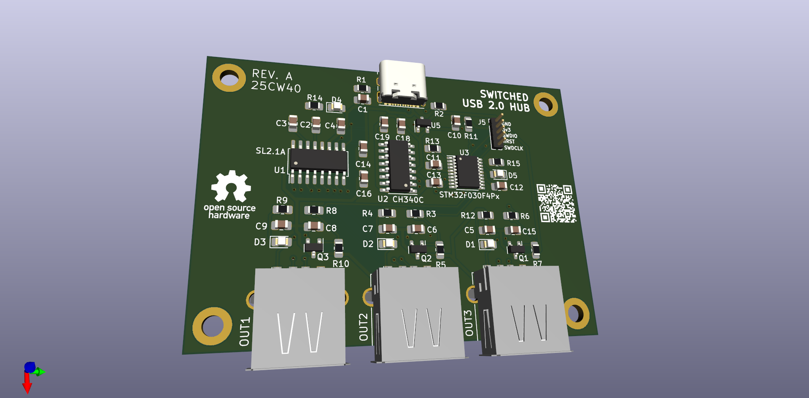

# switched_usb_hub

a very cheap and basic switched usb 2.0 hub design based on:

- SL2.1A USB 4 way hub IC
- CH340C USB - serial adapter
- STM32F030F4Px microcontroller

the mcu that talks with the PC over UART and toggles some FETs using GPIOs. nothing fancy.

original idea to use the SL2.1A: https://github.com/Hugoyhu/ZephyrHub/